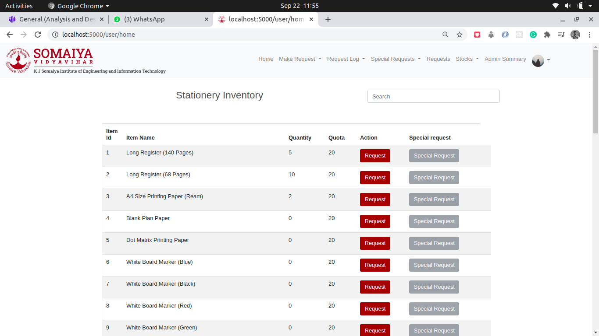
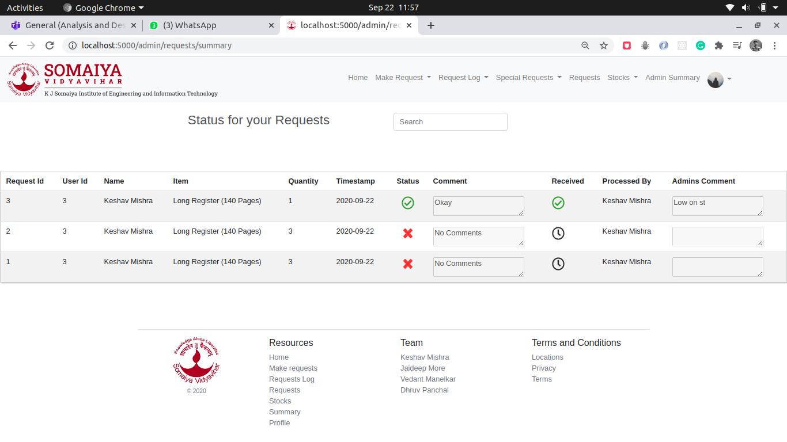
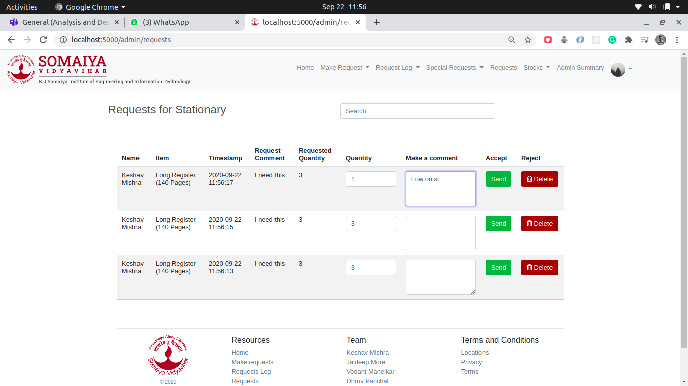
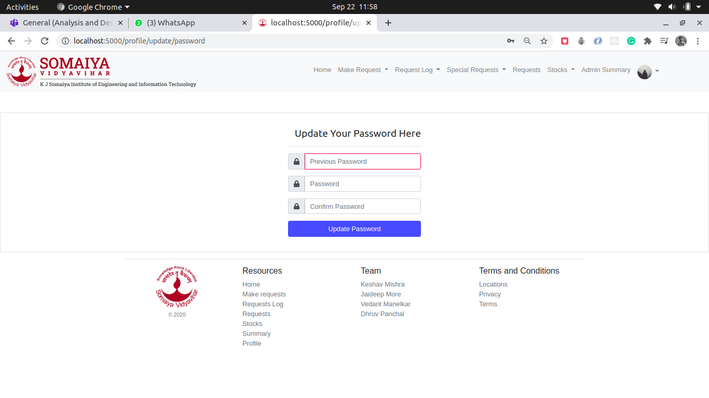
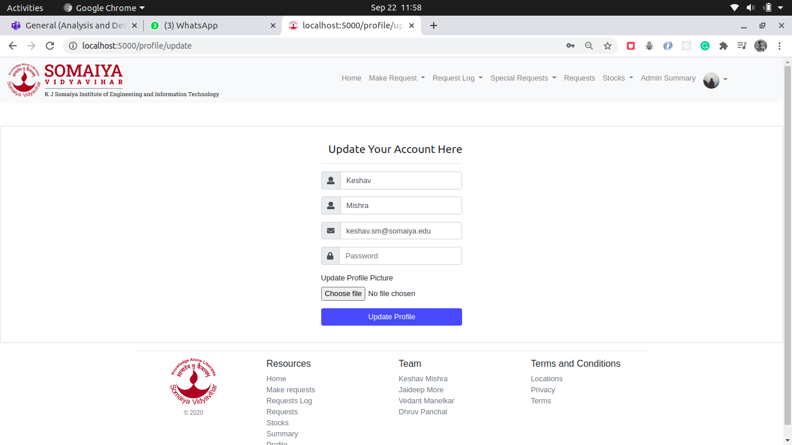

# Requisition-and-Supply-Management-System
 &middot; [](https://github.com/your/your-project/blob/master/LICENSE)


The application helps to keep track of all requisitions made within an organization. This was primarily used to keep logs of the stationery and other goods that are used in our college.
This application provided the users with a page where a formal request can be made for additional supplies of stationery and other commodities. The admin can then view all the requests and accept or reject them depending upon the availability of the requested commodity. This project was made to achieve better inventory control.
### Snapshots of the application 
  
  
  
  
  
  


## Installing / Getting started

Create a virtual env using conda or python-virual-env and then run this command

```shell
pip install -r requirements.txt
```

## Developing

### Built With
Flask,Bootstrap,JavaScript,Python,MySQL,SQLite,HTML,CSS


### Building

If your project needs some additional steps for the developer to build the
project after some code changes, state them here. for example:

```shell
pip install -r requirements.txt
```


```shell
Give an example
```

## Style guide

Write code as per PEP8 standard


## Database

MYSQL

## Licensing

MIT
