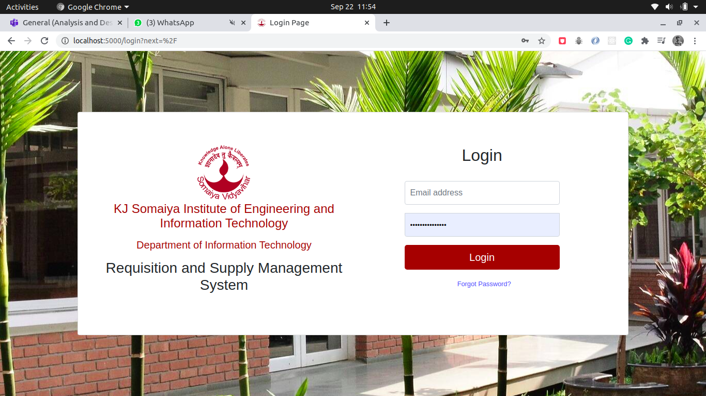
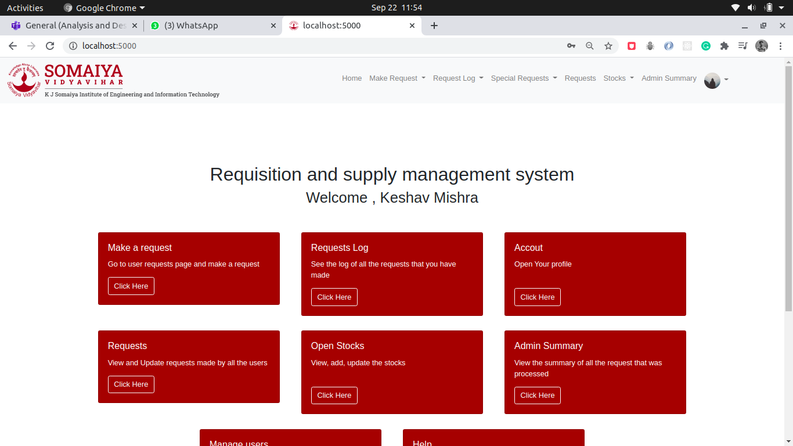
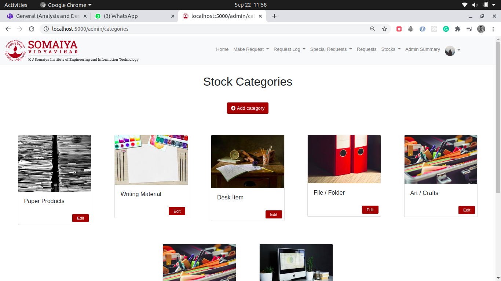
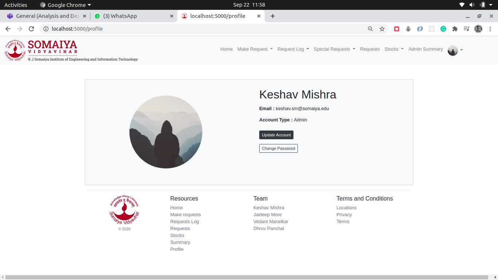

# Requisition-and-Supply-Management-System
 &middot; [](https://github.com/your/your-project/blob/master/LICENSE)


The application helps to keep track of all requisitions made within an organization. This was primarily used to keep logs of the stationery and other goods that are used in our college.
This application provided the users with a page where a formal request can be made for additional supplies of stationery and other commodities. The admin can then view all the requests and accept or reject them depending upon the availability of the requested commodity. This project was made to achieve better inventory control.
### Snapshots of the application 
  
  


## Installing / Getting started

Create a virtual env using conda or python-virual-env and then run this command

```shell
pip install -r requirements.txt
```

## Developing

### Built With
Flask,Bootstrap,JavaScript,Python,MySQL,SQLite,HTML,CSS


### Building

If your project needs some additional steps for the developer to build the
project after some code changes, state them here. for example:

```shell
./configure
make
make install
```

Here again you should state what actually happens when the code above gets
executed.

### Deploying / Publishing
give instructions on how to build and release a new version
In case there's some step you have to take that publishes this project to a
server, this is the right time to state it.

```shell
packagemanager deploy your-project -s server.com -u username -p password
```

And again you'd need to tell what the previous code actually does.

## Versioning

We can maybe use [SemVer](http://semver.org/) for versioning. For the versions available, see the [link to tags on this repository](/tags).


## Configuration

Here you should write what are all of the configurations a user can enter when using the project.

## Tests

Describe and show how to run the tests with code examples.
Explain what these tests test and why.

```shell
Give an example
```

## Style guide

Explain your code style and show how to check it.

## Api Reference

If the api is external, link to api documentation. If not describe your api including authentication methods as well as explaining all the endpoints with their required parameters.


## Database

Explaining what database (and version) has been used. Provide download links.
Documents your database design and schemas, relations etc... 

## Licensing

State what the license is and how to find the text version of the license.
